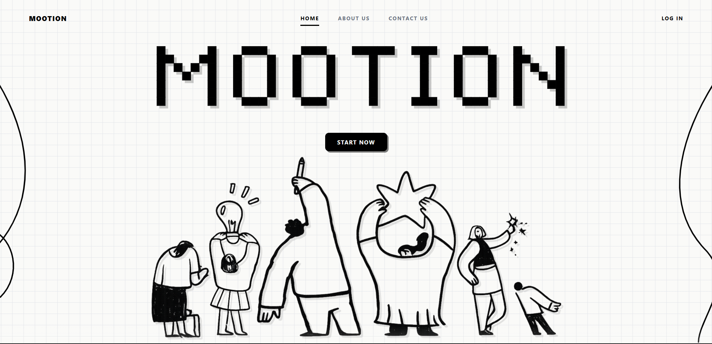
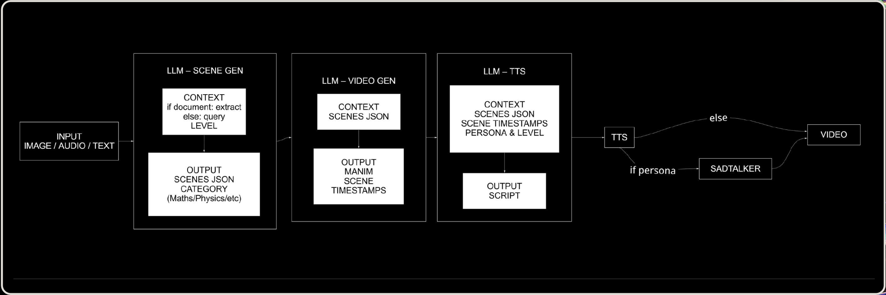
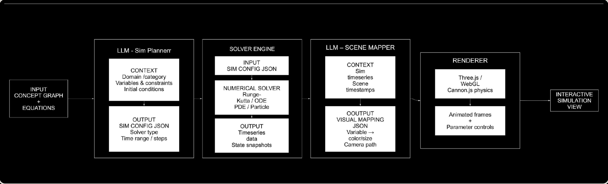
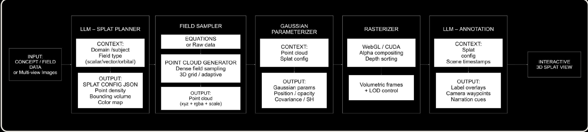

<p align="center">
  <br/>
  
  <br/>
</p>

<p align="center">
  <b>AI-Powered Interactive STEM Learning Platform</b>
</p>

<p align="center">
  Built for <b>WitchHunt 2026</b> &nbsp;·&nbsp; Education Track &nbsp;·&nbsp; by <b>Evolve AI</b>
</p>

<p align="center">
  <a href="#-overview">Overview</a> &nbsp;·&nbsp;
  <a href="#-the-problem">Problem</a> &nbsp;·&nbsp;
  <a href="#-key-features">Features</a> &nbsp;·&nbsp;
  <a href="#-pipelines">Pipelines</a> &nbsp;·&nbsp;
  <a href="#-architecture">Architecture</a> &nbsp;·&nbsp;
  <a href="#-tech-stack">Tech Stack</a> &nbsp;·&nbsp;
  <a href="#-getting-started">Getting Started</a> &nbsp;·&nbsp;
  <a href="#-api-reference">API</a> &nbsp;·&nbsp;
  <a href="#-team">Team</a>
</p>

<p align="center">
  
  
  
  
  
  
  
  
  
  
</p>

<br/>

---

<br/>

## 📖 Overview

You know that moment — the teacher fills the whiteboard with derivations and you're just sitting there, completely lost. The problem isn't you, and it isn't the teacher. **It's the medium.**

Static ink trying to explain a dynamic universe. 2D diagrams standing in for molecular lattices, orbital mechanics, human anatomy. Every learning platform treats these the same: *here's a 10-minute video, here's a PDF, figure it out.*

**MOOTION** is built on a different premise. Concepts shouldn't sit still — they should move, respond, and let you step in`side them.

It is an **AI-native interactive STEM learning platform** targeting the 250 million STEM learners in India who have access to content but lack a connected system to understand, navigate, and retain it. The platform unifies three capabilities in one seamless flow:


> *"No endless tab-switching. No digging through forums. No losing focus. Just keep it in motion."*

<br/>

---

<br/>

## 🎯 The Problem

STEM education is fragmented and passive. Students are drowning in resources but starving for clarity.

- **Spatial concepts are trapped in text.** You cannot understand the depth of human anatomy or the geometry of orbital mechanics from a flat diagram.
- **Dynamic phenomena are frozen.** Wave interference, gravitational fields, molecular bonding — these are inherently alive. Static media kills them.
- **No unified flow exists.** Students scramble between YouTube, PDFs, broken simulations, and doubt forums — losing focus every time they switch.
- **Passive learning doesn't stick.** Without active engagement and structured recall, concepts pile up without ever truly clicking.

### Who it's for

| Persona | Core struggle | How MOOTION helps |
|---|---|---|
| **Arjun**, B.Tech (Mech Engg) | Concepts don't translate from text to understanding | On-demand visual explanations and instant doubt resolution |
| **Riya**, B.Sc (Physics) | Has content, no structure | AI-generated roadmap with topic dependencies |
| **Kabir**, JEE Aspirant | Understands but can't retain | Five active-recall practice modes |

<br/>

---

<br/>

## ✨ Key Features

### 🧭 AI-Generated Learning Roadmaps

Enter any STEM topic or upload your entire syllabus — the AI generates a **structured concept graph** with logical dependencies, prerequisites, and progression paths rendered as an interactive visual canvas.

- **Engine:** Google Gemini (`gemini-3-flash-preview`)
- **Visualization:** React Flow (`@xyflow/react`) with dagre auto-layout (~40 nodes, top-to-bottom directed graph)
- **Node states:** `completed`, `in-progress`, `untouched` with visual indicators
- **Interaction:** Click any node to open its full three-panel concept workspace

### 💬 Conversational AI Tutor

The center panel of every concept workspace is a **topic-aware AI tutor** that engages in natural conversation, maintains full session history, and proactively suggests simulations or practice modes.

- **Model:** Gemini 3 Flash via `@google/genai` SDK
- **Personality:** Concise, friendly, educational — designed for doubt resolution without distraction

### 🎬 Automated Manim Video Generation

A **5-stage backend pipeline** that autonomously produces 3Blue1Brown-style animated explainer videos from any topic — no pre-recorded content, no YouTube links, everything generated on demand.

> See the full pipeline breakdown → [Manim Video Generation Pipeline](#-manim-video-generation-pipeline)

### 🧮 Interactive Simulation Engine

For concepts that need to be *felt* rather than watched — a live, fully interactive physics playground spun up directly inside the learning workspace. Drag parameters, change variables, and watch the laws of physics respond in real time.

> See the full pipeline breakdown → [Simulation Engine Pipeline](#-simulation-engine-pipeline)

### 🌌 3D Gaussian Splat & Three.js Visualizations

For concepts that are fundamentally spatial, MOOTION goes beyond diagrams into **immersive 3D environments** — photorealistic models students can rotate, zoom into, and explore.

> See the full pipeline breakdown → [3D Gaussian Splat Pipeline](#-3d-gaussian-splat-pipeline)

### 🎮 Five Practice Modes

| Mode | Description | Endpoint |
|---|---|---|
| **Challenge** | Timed 10-question MCQ quiz, 30s per question, percentage score | `POST /api/practice/challenge` |
| **Flashcards** | 3D CSS flip-cards with shuffle and navigation | `POST /api/practice/flashcards` |
| **Listen** | AI-generated audio lecture, PCM 24kHz via Web Audio API | `POST /api/practice/listen` + TTS |
| **Prove It** | Teach the AI using voice — it listens, understands, and pushes back with counter-questions | `POST /api/practice/prove-it` + WebSocket |
| **Wrong One** | Spot the incorrect statement among four options, with explanations | `POST /api/practice/wrong-one` |

### 🎤 Real-Time Voice Conversation 

WebSocket-based bidirectional audio streaming. The AI plays a curious student with no prior knowledge — the user teaches it, and it asks questions that force genuine understanding.

> *"If you can explain a topic down to ground zero to an AI that starts with nothing, you truly own the concept."*

- **Voice model:** "Puck" via Gemini Live API, PCM 16kHz
- **Fallback:** Text-based interaction when voice is unavailable

### 📄 RAG-Powered Doubt Engine

Upload any PDF and ask questions with full document context. Keeps your focus locked in the flow without leaving the workspace.

- **Stack:** PyPDFLoader → LangChain splitter → Nomic Embeddings → ChromaDB → Groq (`llama-3.3-70b-versatile`)
- **Retrieval:** Top-12 similarity search, last-6-message context window, automatic summary detection
- **Image Q&A:** OCR via Azure Vision API

<br/>

---

<br/>

## ⚙️ Pipelines

### 🎬 Manim Video Generation Pipeline

Every explainer video in MOOTION is generated from scratch, on demand. There are no pre-recorded clips — the system writes animation code, renders it, generates voiceover, and stitches the final video autonomously.

<p align="center">
  
</p>


### 🧮 Simulation Engine Pipeline

For concepts too dynamic to watch — orbital mechanics, wave superposition, electric fields — the simulation engine translates mathematical equations directly into live, interactive physics environments running in the browser.

<p align="center">
  
</p>


---

### 🌌 3D Gaussian Splat Pipeline

For concepts that are fundamentally spatial — molecular structures, anatomical systems, orbital geometries — MOOTION renders **photorealistic 3D environments** students can step inside. The Gaussian Splat pipeline maps raw field data or multi-view images into navigable volumetric scenes annotated with educational context.

<p align="center">
  
</p>


**GLTF/PLY model support:** For pre-existing 3D assets, MOOTION loads real GLTF and PLY files via Three.js to create photorealistic interactive environments without running the full splat pipeline.

<br/>

---

<br/>

## 🏗 Architecture

MOOTION follows a **two-backend microservices** architecture with a unified Express + React frontend:

```
┌────────────────────────────────────────────────────────────────────┐
│                        BROWSER (Port 3000)                         │
│                                                                    │
│  React 19 + Vite 6 + Tailwind v4 + Motion + ReactFlow + Three.js   │
│                                                                    │
│  ┌──────────────┐  ┌──────────────┐  ┌────────────────────────┐    │
│  │  Home/Onboard │  │  Roadmap     │  │  Concept Workspace    │    │
│  │  (pixel-art)  │  │  (ReactFlow) │  │ ┌──────┬────┬───────┐ │    │
│  └──────────────┘  └──────────────┘  │ │ Chat │Viz │Practice│ │    │
│                                        │ └──────┴────┴───────┘│    │
│                                        └──────────────────────┘    │
│                                                                    │
│  ┌─────────────────────────────────────────────────────────────┐   │
│  │                  Express 4 Server (server.ts)               │   │
│  │  ┌────────────────┐ ┌──────────────┐ ┌────────────────-┐    │   │
│  │  │  Gemini AI API  │ │  Vite Dev    │ │  WebSocket     │    │   │
│  │  │  (Chat, TTS,    │ │  Middleware   │ │  (/live)      │    │   │
│  │  │  Roadmaps, Quiz)│ │              │ │  Gemini Live   │    │   │
│  │  └────────────────┘ └──────────────┘ └────────────────-┘    │   │
│  └─────────────────────────────────────────────────────────────┘   │
└──────────────────────────┬─────────────────────────────────────────┘
                           │
              ┌────────────┴────────────┐
              ▼                         ▼
┌───────────────────────-─┐   ┌─────────────────────────-┐
│  Backend: API Service   │   │  Backend: Pipeline       │ 
│  (FastAPI, :8000)       │   │  (FastAPI, :8001)        │
│                         │   │                          │
│  Q&A / RAG (Groq+Chroma)│   │  Stage 1: Scene Plan     │
│  TTS / Flashcards/Quiz  │   │  Stage 2: Manim Render   │
│  Play Modes (3 games)   │   │  Stage 3: Script Gen     │
│  SadTalker Face Anim    │   │  Stage 4: Azure TTS      │
│  Roadmap CRUD           │   │  Stage 5: Stitch + Mux   │
│  Chat History           │   │  + SadTalker (optional)  │
│                         │   │                          │
│  PostgreSQL (Neon)      │   │  Filesystem: media/      │
│  ChromaDB (vectors)     │   │  outputs/ data/          │
│  AssemblyAI STT         │   │                          │
└───────────────────────-─┘   └─────────────────────────-┘
```

<br/>

---

<br/>

## ⚙️ Tech Stack

### Frontend

| Category | Technology | Purpose |
|---|---|---|
| **UI Framework** | React 19 + TypeScript 5.8 | Component model with strict typing |
| **Build Tool** | Vite 6 + `@vitejs/plugin-react` | HMR, bundling, React Fast Refresh |
| **Server Runtime** | Express 4 (`server.ts`) | API routes + Vite middleware + WebSocket |
| **Routing** | React Router v7 | Client-side SPA routing |
| **Styling** | Tailwind CSS v4 + Autoprefixer | Utility-first CSS |
| **Animation** | Motion v12 (Framer Motion successor) | Spring animations, pixel-art reveal, scroll morphing |
| **Graph Viz** | `@xyflow/react` v12 + `dagre` v0.8 | Interactive concept roadmap |
| **3D Rendering** | Three.js (3,106-line engine) | Solar system + GLTF/PLY model viewer |
| **2D Physics** | HTML5 Canvas | Interactive physics simulations |
| **AI SDK** | `@google/genai` v1.29 | Gemini: chat, TTS, roadmaps, quizzes, Live API |
| **WebSocket** | `ws` v8 | Gemini Live API voice streaming |

### Backend — API Service (port 8000)

| Category | Technology | Purpose |
|---|---|---|
| **Framework** | FastAPI (Python 3.11+) | Async REST API |
| **Database** | PostgreSQL (Neon) via SQLAlchemy | Chats, messages, documents, videos, roadmaps |
| **Vector Store** | ChromaDB | Document embeddings for RAG |
| **LLM** | Groq (`llama-3.3-70b-versatile`) | Ultra-fast Q&A generation |
| **Embeddings** | Nomic AI (`nomic-embed-text-v1.5`) | Document vectorization |
| **TTS** | Azure Speech SDK | Neural text-to-speech |
| **STT** | AssemblyAI | Speech-to-text transcription |
| **OCR** | Azure Vision | Text extraction from images |
| **Face Animation** | SadTalker + GFPGAN | Talking-head avatar generation |

### Backend — Pipeline Service (port 8001)

| Category | Technology | Purpose |
|---|---|---|
| **Framework** | FastAPI (Python 3.11+) | Video generation pipeline API |
| **LLM** | Azure OpenAI | Scene planning, Manim code gen, narration |
| **Animation** | Manim (community edition) | Programmatic math animations |
| **TTS** | Azure Speech SDK | Per-scene neural voiceover |
| **Video Processing** | FFmpeg + FFprobe | Muxing, stitching, duration analysis |
| **Face Animation** | SadTalker | Talking-head overlay on final video |

<br/>

---

<br/>

## 🚀 Getting Started

### Prerequisites

- **Node.js** v20+ and **npm** v10+
- **Python 3.11+** with `pip` and `venv`
- **FFmpeg** + **FFprobe** on PATH
- **Manim** community edition: `pip install manim`
- API keys: Gemini, Azure (OpenAI + Speech + Vision), Groq, Nomic, AssemblyAI, Neon PostgreSQL

### Frontend Setup

```bash
cd Frontend
npm install
cp .env.example .env
# Edit .env → set GEMINI_API_KEY

npm run dev
# → http://localhost:3000
```

### Backend — API Service

```bash
cd backend/backend
python -m venv venv
source venv/bin/activate   # Windows: venv\Scripts\activate
pip install -r ../requirements.txt
pip install -r requirements.txt

uvicorn app.main:app --reload --port 8000
```

### Backend — Pipeline Service

```bash
cd backend
python -m venv venv
source venv/bin/activate
pip install -r requirements.txt
mkdir -p outputs/scenes outputs/audio outputs/videos media

uvicorn app.main:app --reload --port 8001
```

### Production Build

```bash
cd Frontend
npm run build     # vite build + esbuild server bundle → dist/
npm start         # node dist/server.cjs on port 3000
```

<br/>

---

<br/>

## 🔐 Environment Variables

### Frontend (`.env`)

| Variable | Required | Description |
|---|---|---|
| `GEMINI_API_KEY` | Yes | Google Gemini API key for all AI features |

### Backend — API Service (`backend/backend/.env`)

| Variable | Required | Description |
|---|---|---|
| `DATABASE_URL` | Yes | Neon PostgreSQL connection string |
| `GROQ_API_KEY` | Yes | Groq API key for LLM inference |
| `NOMIC_API_KEY` | Yes | Nomic AI key for text embeddings |
| `ASSEMBLYAI_API_KEY` | Yes | AssemblyAI key for speech-to-text |
| `AZURE_SPEECH_KEY` | Yes | Azure Speech key for TTS |
| `AZURE_SPEECH_REGION` | Yes | Azure Speech region (e.g. `eastus`) |
| `AZURE_VISION_ENDPOINT` | Yes | Azure Vision endpoint URL |
| `AZURE_VISION_KEY` | Yes | Azure Vision API key |
| `SADTALKER_DIR` | Yes | Absolute path to SadTalker installation |
| `VECTOR_DB_DIR` | Yes | Path for ChromaDB persistence directory |
| `DOCUMENT_UPLOAD_DIR` | Yes | Path for uploaded document storage |

### Backend — Pipeline Service (`backend/.env`)

| Variable | Required | Description |
|---|---|---|
| `AZURE_OPENAI_API_VERSION` | Yes | e.g. `2025-04-14` |
| `AZURE_OPENAI_ENDPOINT` | Yes | Azure OpenAI resource endpoint |
| `AZURE_API_KEY` | Yes | Azure OpenAI API key |
| `AZURE_OPENAI_DEPLOYMENT` | Yes | Azure OpenAI deployment name |
| `AZURE_SPEECH_KEY` | Yes | Azure Speech key |
| `AZURE_SPEECH_REGION` | Yes | Azure Speech region |

<br/>

---

<br/>

## 📡 API Reference

### Frontend API (Express — Port 3000)

#### `POST /api/generate-roadmap/text`
```json
// Req: { "topic": "Orbital Mechanics" }
// Res: { "nodes": [{id, label, description, status}], "edges": [{id, source, target}] }
```

#### `POST /api/generate-roadmap/file`
`multipart/form-data`, field: `syllabus` (PDF/PNG/JPG, max 10MB)

#### `POST /api/chat`
```json
// Req: { "topic": "...", "history": [{role, text}], "message": "..." }
// Res: { "text": "..." }
```

#### `POST /api/practice/challenge`
Returns 10 MCQs with `question`, `options[4]`, `correctAnswerIndex`.

#### `POST /api/practice/flashcards`
Returns 10 cards with `front` and `back`.

#### `POST /api/practice/listen`
Returns `{ "sentences": [...] }` for TTS rendering.

#### `POST /api/practice/tts`
```json
// Req: { "text": "..." }
// Res: { "audioBase64": "..." }  // PCM s16le 24kHz mono
```

#### `POST /api/practice/prove-it`
`isEndSession: true` triggers scoring and feedback.

#### `POST /api/practice/wrong-one`
Returns 10 questions with `wrongAnswerIndex` and `explanation`.

#### `WebSocket /live?topic=<topic>`
```
Client → Server: { "audio": "<base64 PCM 16kHz>" }
Server → Client: { "audio": "<base64>" } | { "interrupted": true }
```

---

### Backend API (FastAPI — Port 8000)

| Method | Endpoint | Description |
|---|---|---|
| `POST` | `/qa/upload-doc` | Upload PDF for RAG ingestion |
| `POST` | `/qa/ask` | Ask with optional doc context + video generation |
| `POST` | `/qa/ask-from-image` | OCR + answering from image |
| `POST` | `/video/generate` | SadTalker video generation |
| `POST` | `/api/tts` | Text-to-speech |
| `POST` | `/api/flashcards` | Flashcard generation |
| `POST` | `/api/quiz` | Quiz generation |
| `POST` | `/api/roadmap` | Roadmap CRUD |
| `POST` | `/api/chat-history` | Session and message management |
| `POST` | `/api/play/teach-ai` | Document-grounded teaching game |
| `POST` | `/api/play/find-mistake` | Error detection game |
| `POST` | `/api/play/complete-missing-link` | Gap-filling game |

---

### Pipeline Service (FastAPI — Port 8001)

#### `POST /explain`
Run the full 5-stage Manim video generation pipeline.
- **Params:** `topic`, `level` (default: `school`), `persona` (default: `teacher`), `face_enabled` (default: `false`)
- **Returns:** `{ "status": "complete", "video_id": "uuid", "video_path": "..." }`

#### `GET /video/{video_id}`
Serve generated video. Returns `404` if pipeline incomplete.

<br/>

<br/>

---

<br/>

## 👥 Team - Evolve AI

Built for the **WitchHunt Hackathon 2026**, targeting 250 million STEM learners in India.

| Name | Role |
|---|---|


| **Goyam Jain** | Lead ML Engineer — AI development and model optimisation |
| **Poorvika Grover** | Design & UX Lead — end-to-end visual identity and user journey |
| **Rachit Goyal** | Systems Architect & Backend — core framework design and backend orchestration |
| **Sartaj Kaur** | Product Lead & Strategy — product vision, roadmap, and user-centric execution |

<br/>

---

<p align="center">
  <sub>© MOOTION — WitchHunt Hackathon 2026 — Education Track</sub>
</p>